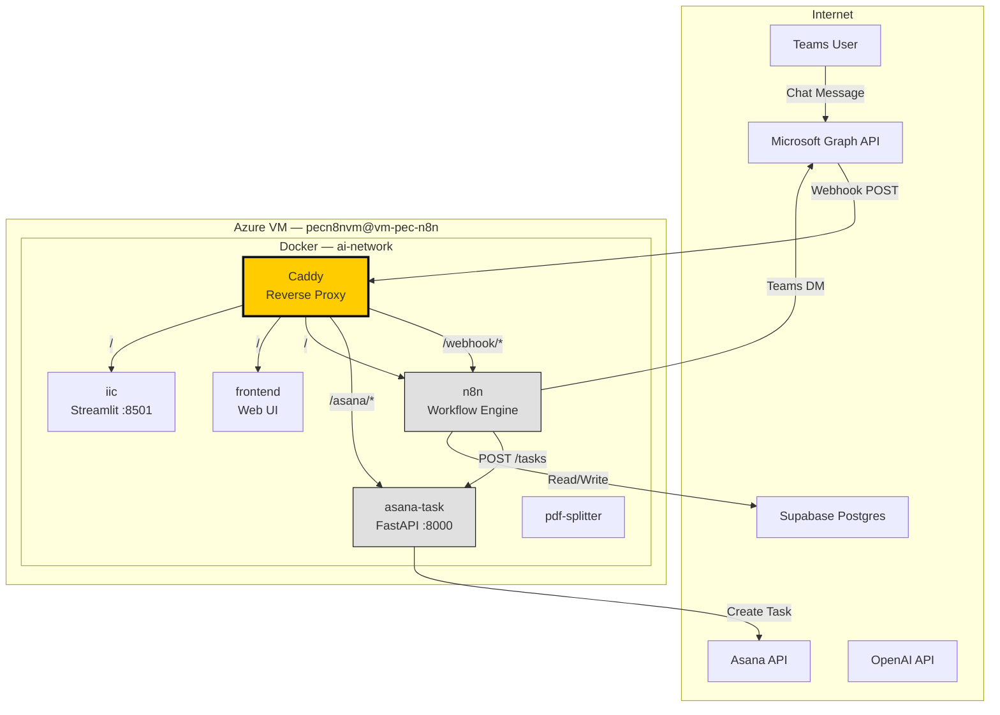
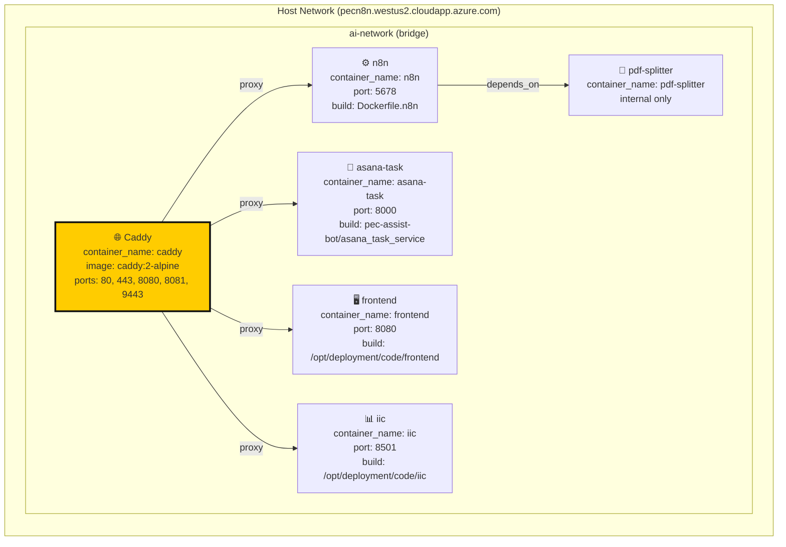
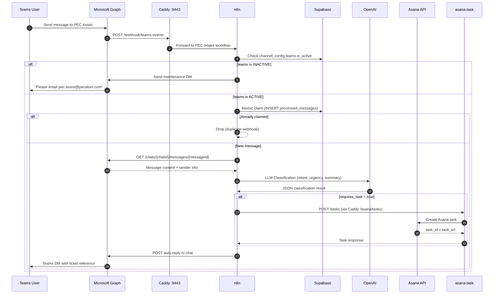
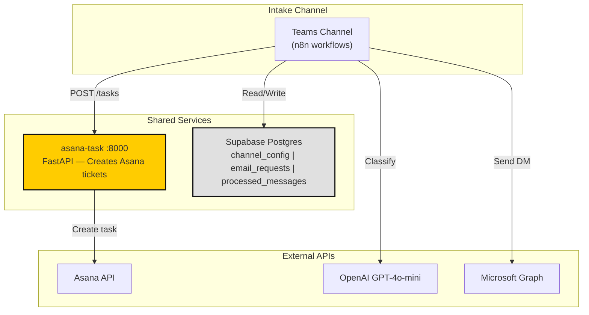
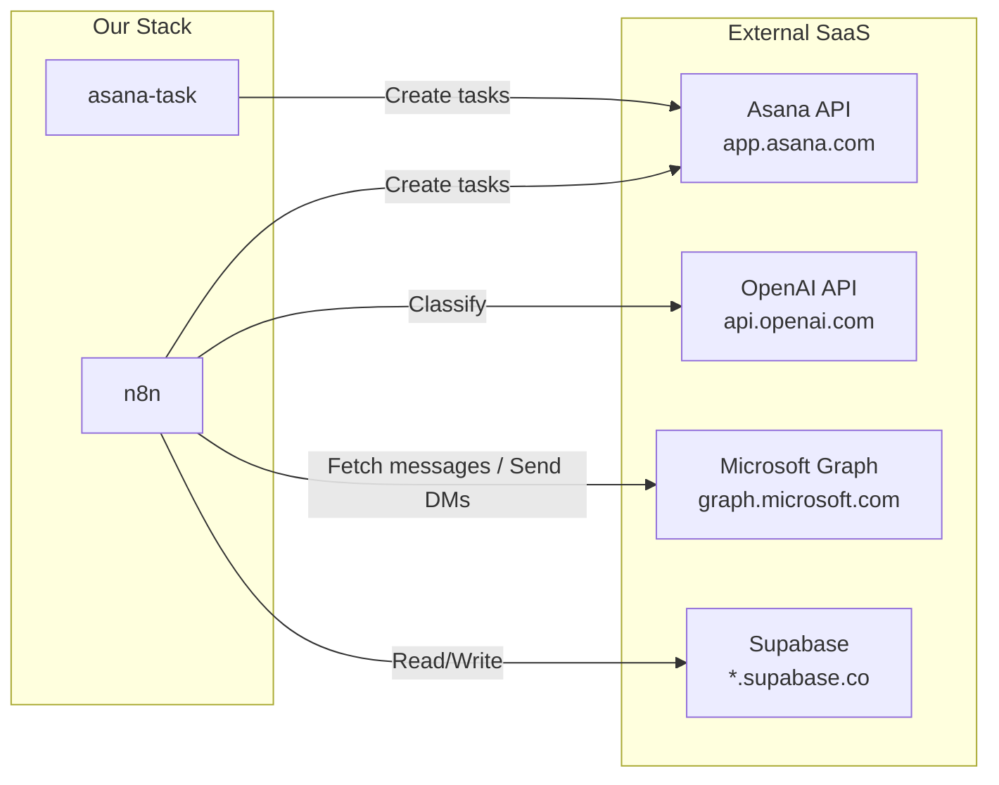
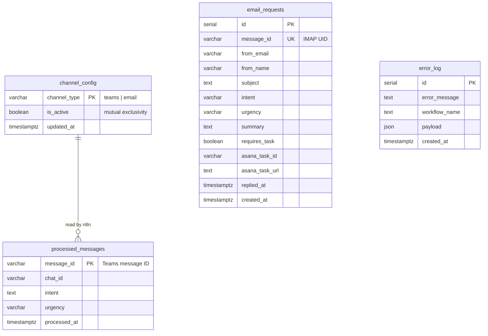

# PEC Assist — Infrastructure Architecture

> **Last Updated:** April 30, 2026  
> **Applies to:** `vm-pec-n8n` (`pecn8n.westus2.cloudapp.azure.com`)  
> **Scope:** PEC Assist Docker containers only (n8n, asana-task, frontend, iic, pdf-splitter, caddy)

> 🟢 **Production:** n8n workflows + `asana-task` FastAPI service  
> ⚪ **Out of scope:** `invoice-api`, `invoice-dashboard`, `acs-email` — separate projects on the same VM

---

## Table of Contents

1. [Overview](#overview)
2. [Docker Network Topology](#docker-network-topology)
3. [Caddy Routing & Port Mapping](#caddy-routing--port-mapping)
4. [Teams Channel — Request Flow](#teams-channel--request-flow)
5. [Shared Services](#shared-services)
7. [External Services Dependency Map](#external-services-dependency-map)
8. [Database & Persistence](#database--persistence)
9. [Environment Variables Reference](#environment-variables-reference)
10. [Deployment Layout on VM](#deployment-layout-on-vm)

---

## Overview

PEC Assist runs as a **Docker Compose stack** on a single Azure VM. All containers share a private bridge network (`ai-network`). A **Caddy reverse proxy** is the only container that exposes ports to the internet. Every other service is reached through Caddy's path-based routing.

The **Teams** channel is the primary intake. All workflow orchestration runs inside n8n.



---

## Docker Network Topology

All containers connect to a single Docker bridge network called `ai-network`. No container except Caddy binds to host ports. Internal services communicate using container names as DNS hostnames.



### Container Responsibilities

| Container | Internal Port | Purpose | Reaches Out To |
|-----------|--------------|---------|---------------|
| `caddy` | 80, 443, 8080, 8081, 9443 | Reverse proxy + TLS termination | Nothing (only receives) |
| `n8n` | 5678 | Workflow automation engine (PEC-Intake, PEC-Classifier, PEC-Responder, Asana-Poller) | Asana API, Microsoft Graph, OpenAI, Supabase |
| `asana-task` | 8000 | FastAPI microservice — creates Asana tasks | Asana API |
| `frontend` | 8080 | Web UI | Nothing (served via Caddy) |
| `iic` | 8501 | Streamlit interface | Nothing (served via Caddy) |
| `pdf-splitter` | — | PDF processing utility | Nothing (called by n8n) |

---

## Caddy Routing & Port Mapping

Caddy is the **single point of entry** from the internet. It handles TLS (HTTPS) and routes requests by path.

### External → Internal Routing Table

| External URL | Caddy Port | Path Match | Internal Destination | Purpose |
|-------------|-----------|-----------|---------------------|---------|
| `https://pecn8n.westus2.cloudapp.azure.com:9443/` | 9443 | `/` | `n8n:5678` | n8n Editor + Webhooks |
| `https://pecn8n.westus2.cloudapp.azure.com:9443/asana/*` | 9443 | `/asana/*` | `asana-task:8000` | Asana Task Service API |
| `https://pecn8n.westus2.cloudapp.azure.com:8080/` | 8080 | `/` | `frontend` | Web Frontend |
| `https://pecn8n.westus2.cloudapp.azure.com:8081/` | 8081 | `/` | `iic:8501` | Streamlit IIC Interface |

### Caddyfile Snippet

```caddy
pecn8n.westus2.cloudapp.azure.com:9443 {
    handle_path /asana/* {
        reverse_proxy asana-task:8000
    }
    reverse_proxy n8n:5678
}
```

> **Key Point:** `asana-task` is **never exposed directly** to the internet. All traffic goes through Caddy on port 9443.

---

## Teams Channel — Request Flow

This is the original path. It is fully orchestrated by n8n workflows.



### Active n8n Workflows (Teams Path)

| Workflow | ID | Trigger | Purpose | Active |
|----------|-----|---------|---------|--------|
| **PEC-Intake** | `3CpsxZLMLHAXPnFz` | Webhook (`/webhook/teams-events`) | Entry point — validates webhook, checks channel toggle, atomic claim | ✅ |
| **PEC-Classifier** | `zHSGTpk1RJGPD9MY` | Called by PEC-Intake | Fetches message, runs LLM, creates Asana task, calls Responder | ✅ |
| **PEC-Responder** | `HJ9NigH9QU1bORGE` | Called by PEC-Classifier | Sends Teams DM reply to user | ✅ |
| **Asana-Poller** | `bi8LtU1JETJwjZQq` | Schedule (every 5 min) | Polls Asana for task updates, sends Teams DM notifications | ✅ |
| **Auto Subscription Lifecycle Manager** | `aRY0HcvD0wctDjuB` | Schedule | Manages Microsoft Graph webhook subscription renewal | ✅ |
| **PEC-Error-Handler** | `gZxrCH09fh6NK7CU` | Error trigger | Handles n8n execution errors, sends alerts | ✅ |

---

## Shared Services

Both channels converge on the same **Asana Task Service** and read from the same **Supabase toggle**.



### Mutual Exclusivity (The Toggle)

The `channel_config` table tracks channel state. Currently only the Teams channel is active:

```sql
SELECT * FROM channel_config;
-- teams  | true  | 2026-04-30T12:00:00Z
```

---

## External Services Dependency Map



### Service Account / Credential Requirements

| External Service | Credential Type | Stored In | Used By |
|-----------------|----------------|-----------|---------|
| Asana API | Personal Access Token | `.env` → `ASANA_TOKEN` | `asana-task`, `n8n` |
| OpenAI API | API Key | `.env` → `OPENAI_API_KEY` | `n8n` |
| Microsoft Graph | OAuth2 (n8n credential) | n8n credential store | `n8n` |
| Supabase | Service Key | `.env` → `SUPABASE_SERVICE_KEY` | `n8n` |

---

## Database & Persistence

All persistent state lives in a single **Supabase Postgres** project.



### Table Responsibilities

| Table | Written By | Read By | Purpose |
|-------|-----------|---------|---------|
| `channel_config` | `n8n` | `n8n` | Channel toggle state |
| `processed_messages` | `n8n` (PEC-Intake) | `n8n` (atomic claim check) | Deduplication of Teams webhooks |
| `error_log` | `n8n` (PEC-Error-Handler) | Operators | Centralized error tracking |

---

## Environment Variables Reference

### Global `.env` file on VM (`~/ai-initiative/.env`)

```bash
# ── Asana (shared by n8n + asana-task) ──
ASANA_TOKEN=your_asana_token
ASANA_PROJECT_ID=your_project_id
ASANA_WORKSPACE_ID=your_workspace_id

# ── OpenAI (n8n) ──
OPENAI_API_KEY=sk-...

# ── Supabase (n8n) ──
SUPABASE_URL=https://your-project.supabase.co
SUPABASE_SERVICE_KEY=eyJ...

# ── Internal Service Discovery ──
ASANA_SERVICE_URL=http://asana-task:8000

# ── n8n ──
DASHSCOPE_API_KEY=...
```

### Which Service Needs What

| Variable | n8n | asana-task | Caddy | frontend | iic |
|----------|-----|-----------|-------|---------|-----|
| `ASANA_TOKEN` | ✅ | ✅ | — | — | — |
| `ASANA_PROJECT_ID` | ✅ | ✅ | — | — | — |
| `OPENAI_API_KEY` | ✅ | — | — | — | — |
| `SUPABASE_URL` | ✅ | — | — | — | — |
| `SUPABASE_SERVICE_KEY` | ✅ | — | — | — | — |
| `DASHSCOPE_API_KEY` | ✅ | — | — | — | — |

---

## Deployment Layout on VM

```
~/ai-initiative/
├── docker-compose.yml          # All services defined here
├── Caddyfile                   # Reverse proxy rules
├── .env                        # All secrets and config
├── n8n_data/                   # n8n workflow + credential persistence
├── pec-assist-bot/             # Git repo (PEC Assist)
│   ├── src/
│   │   └── asana_task_service/ # FastAPI — Asana task creation
│   └── ...
├── pdf-splitter/               # PDF utility (n8n dependency)
├── acs-email-service/          # Legacy Node.js email service (out of scope)
├── frontend/                   # Web UI (external build)
├── iic/                        # Streamlit app (external build)

├── caddy_data/                 # TLS certificates
└── caddy_config/               # Caddy runtime config
```

### Start / Stop / Restart Commands

```bash
# Full stack
cd ~/ai-initiative
docker-compose up -d
docker-compose down

# Individual services
docker-compose restart caddy
docker-compose logs -f asana-task
```

---

## Change Log

| Date | Change | Author |
|------|--------|--------|
| 2026-04-06 | Initial Teams-only architecture | PEC Dev |
| 2026-04-09 | Added Asana-Poller workflow | PEC Dev |
| 2026-05-03 | Removed email-task service (out of scope) | PEC Dev |
